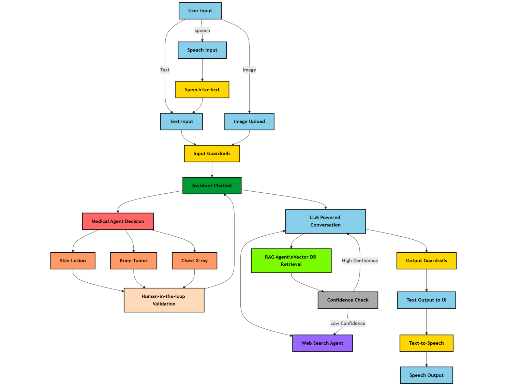

<div align="center">

<h1 align="center"><strong>⚕️ Multi-Agent-Medical-Assistant <h6 align="center">AI-powered multi-agentic system for medical diagnosis and assistance</h6></strong></h1>


</div>


## 📚 Table of Contents
- [Overview](#overview)
- [Demo](#demo)
- [Technical Flow Chart](#technical-flowchart)
- [Key Features](#key-features)
- [Tech Stack](#technology-stack)
- [Installation and Setup](#installation-setup)
  - [Using Docker](#docker-setup)
  - [Manual Installation](#manual-setup)
- [Usage](#usage)

----

## 📌 Overview <a name="overview"></a>

The **Multi-Agent Medical Assistant** is an **AI-powered chatbot** designed to assist with **medical diagnosis, research, and patient interactions**.  

🚀 **Powered by Multi-Agent Intelligence**, this system integrates:  
- **🤖 Large Language Models (LLMs)**  
- **🖼️ Computer Vision Models** for medical imaging analysis  
- **📚 Retrieval-Augmented Generation (RAG)** leveraging vector databases  
- **🌐 Real-time Web Search** for up-to-date medical insights  
- **👨‍⚕️ Human-in-the-Loop Validation** to verify AI-based medical image diagnoses  

---

## 💫 Demo <a name="demo"></a>


 <br>
[](https://youtu.be/cV3Fgz52w6I)

---

## 🛡️ Technical Flow Chart  <a name="technical-flowchart"></a>



---

<!-- ## 🌟 Key Features  <a name="key-features"></a>
✅ **Multi-Agent System** – Separate agents handle different tasks (diagnosis, retrieval, reasoning, etc.).  
✅ **RAG-based Retrieval** – Uses Qdrant for vector search & hybrid retrieval techniques.  
✅ **Medical Image Analysis** – Supports **brain tumor segmentation, chest X-ray disease detection, and skin lesion classification**.  
✅ **Web Search Agent** – Fetches the latest medical research when required.  
✅ **Confidence Score Check** – Ensures high accuracy with log probability-based verification.  
✅ **Speech-to-Text & Text-to-Speech** – Uses **Eleven Labs API** for voice interactions.  
✅ **Human-in-the-Loop Verification** – Medical professionals validate the AI’s results before final output.  
✅ **Intuitive UI** – Built for seamless user experience.  

---

## 🛠️ Tech Stack  <a name="tech-stack"></a>
🔹 **Backend**: FastAPI 🚀  
🔹 **Multi-Agent Orchestration**: LangGraph + LangChain 🤖  
🔹 **Vector Database**: Qdrant (for retrieval-augmented generation) 🔍  
🔹 **Medical Image Analysis**: Computer vision models (Brain Tumor - Semantic Segmentation, Chest X-ray - Object Detection, Skin Lesion - Classification) 🏥  
🔹 **Speech Processing**: Eleven Labs API 🎙️  
🔹 **UI**: HTML, CSS, JS 🌐  
🔹 **Deployment**: Docker 🛠️   -->

## ✨ Key Features  <a name="key-features"></a>

- 🤖 **Multi-Agent Architecture** : Specialized agents working in harmony to handle diagnosis, information retrieval, reasoning, and more

- 🔍 **Advanced RAG Retrieval System** :

  - Docling based parsing to extract text, tables, and images from PDFs.
  - Embedding markdown formatted text, tables and LLM based image summaries.
  - LLM based semantic chunking with structural boundary awareness.
  - LLM based query expansion with related medical domain terms.
  - Qdrant hybrid search combining BM25 sparse keyword search along with dense embedding vector search.
  - Input-output guardrails to ensure safe and relevant responses.
  - Confidence-based agent-to-agent handoff between RAG and Web Search to prevent hallucinations.

- 🏥 **Medical Imaging Analysis**  
  - Brain Tumor Detection (TBD)
  - Chest X-ray Disease Classification
  - Skin Lesion Segmentation

- 🌐 **Real-time Research Integration** : Web search agent that retrieves the latest medical research papers and findings

- 📊 **Confidence-Based Verification** : Log probability analysis ensures high accuracy in medical recommendations

- 🎙️ **Voice Interaction Capabilities** : Seamless speech-to-text and text-to-speech powered by Eleven Labs API

- 👩‍⚕️ **Expert Oversight System** : Human-in-the-loop verification by medical professionals before finalizing outputs

- ⚔️ **Input & Output Guardrails** : Ensures safe, unbiased, and reliable medical responses while filtering out harmful or misleading content

- 💻 **Intuitive User Interface** : Designed for healthcare professionals with minimal technical expertise

> [!NOTE]  
> Upcoming features:
> 1. Brain Tumor Medical Computer Vision model integration.
> 2. Open to suggestions.

---

## 🛠️ Technology Stack  <a name="technology-stack"></a>

| Component | Technologies |
|-----------|-------------|
| 🔹 **Backend Framework** | FastAPI |
| 🔹 **Agent Orchestration** | LangGraph |
| 🔹 **Document Parsing** | Docling |
| 🔹 **Knowledge Storage** | Qdrant Vector Database |
| 🔹 **Medical Imaging** | Computer Vision Models |
| | • Brain Tumor: Object Detection (PyTorch) |
| | • Chest X-ray: Image Classification (PyTorch) |
| | • Skin Lesion: Semantic Segmentation (PyTorch) |
| 🔹 **Guardrails** | LangChain |
| 🔹 **Speech Processing** | Eleven Labs API |
| 🔹 **Frontend** | HTML, CSS, JavaScript |
| 🔹 **Deployment** | Docker, GitHub Actions CI/CD |

---

## 🚀 Installation & Setup  <a name="installation-setup"></a>

## 📌 Option 1: Using Docker  <a name="docker-setup"></a>

### Prerequisites:

- [Docker](https://docs.docker.com/get-docker/) installed on your system
- API keys for the required services

### 1️⃣ Clone the Repository
```bash
git clone https://github.com/abhikalparya/MedBot
cd MedBot
```

### 2️⃣ Create Environment File
- Create a `.env` file in the root directory and add the following API keys:

> [!NOTE]  
> You may use any llm and embedding model of your choice...


> [!WARNING]  
> Ensure the API keys in the `.env` file are correct and have the necessary permissions.

```bash
# LLM Configuration (OpenAI)
model_name = gpt-4o-mini
openai_api_key = ''

# Embedding Model Configuration (OpenAI)
embedding_model_name = text-embedding-3-small
embedding_openai_api_key = ''

# Speech API Key (Free credits available with new Eleven Labs Account)
ELEVEN_LABS_API_KEY = ''

# Web Search API Key (Free credits available with new Tavily Account)
TAVILY_API_KEY = ''

# Hugging Face Token - using reranker model "ms-marco-TinyBERT-L-6"
HUGGINGFACE_TOKEN = ''

# (OPTIONAL) If using Qdrant server version, local does not require API key
QDRANT_URL = your_qdrant_url_here  # Optional
QDRANT_API_KEY = your_qdrant_api_key_here  # Optional 
```

### 3️⃣ Build the Docker Image
```bash
docker build -t medical-assistant .
```

### 4️⃣ Run the Docker Container
```bash
docker run -d \
  --name medical-assistant-app \
  -p 8000:8000 \
  --env-file .env \
  -v $(pwd)/data:/app/data \
  -v $(pwd)/uploads:/app/uploads \
  medical-assistant
```
The application will be available at: `http://localhost:8000`

### 5️⃣ Ingest Data into Vector DB from Docker Container

- To ingest a single document:
```bash
docker exec medical-assistant-app python ingest_rag_data.py --file ./data/raw/brain_tumors_ucni.pdf
```

- To ingest multiple documents from a directory:
```bash
docker exec medical-assistant-app python ingest_rag_data.py --dir ./data/raw
```

### Managing the Container:

#### Stop the Container
```bash
docker stop medical-assistant-app
```

#### Start the Container
```bash
docker start medical-assistant-app
```

#### View Logs
```bash
docker logs medical-assistant-app
```

#### Remove the Container
```bash
docker rm medical-assistant-app
```

### Troubleshooting:

#### Container Health Check
The container includes a health check that monitors the application status. You can check the health status with:
```bash
docker inspect --format='{{.State.Health.Status}}' medical-assistant-app
```

#### Container Not Starting
If the container fails to start, check the logs for errors:
```bash
docker logs medical-assistant-app
```


## 📌 Option 2: Manual Installation  <a name="manual-setup"></a>

### 1️⃣ Clone the Repository  
```bash  
git clone https://github.com/abhikalparya/MedBot
cd MedBot 
```

### 2️⃣ Create & Activate Virtual Environment  
- If using conda:
```bash
conda create --name <environment-name> python=3.11
conda activate <environment-name>
```
- If using python venv:
```bash
python -m venv <environment-name>
source <environment-name>/bin/activate  # For Mac/Linux
<environment-name>\Scripts\activate     # For Windows  
```

### 3️⃣ Install Dependencies  

> [!IMPORTANT]  
> ffmpeg is required for speech service to work.

- If using conda:
```bash
conda install -c conda-forge ffmpeg
```
```bash
pip install -r requirements.txt  
```
- If using python venv:
```bash
winget install ffmpeg
```
```bash
pip install -r requirements.txt  
```

### 4️⃣ Set Up API Keys  
- Create a `.env` file and add the required API keys as shown in `Option 1`.

### 5️⃣ Run the Application  
- Run the following command in the activate environment.

```bash
python app.py
```
The application will be available at: `http://localhost:8000`

### 6️⃣ Ingest additional data into the Vector DB
Run any one of the following commands as required.
- To ingest one document at a time:
```bash
python ingest_rag_data.py --file ./data/raw/brain_tumors_ucni.pdf
```
- To ingest multiple documents from a directory:
```bash
python ingest_rag_data.py --dir ./data/raw
```

---

## 🧠 Usage  <a name="usage"></a>

> [!NOTE]
> 1. The first run can be jittery and may get errors - be patient and check the console for ongoing downloads and installations.
> 2. On the first run, many models will be downloaded - yolo for tesseract ocr, computer vision agent models, cross-encoder reranker model, etc.
> 3. Once they are completed, retry. Everything should work seamlessly since all of it is thoroughly tested.

- Upload medical images for **AI-based diagnosis**. Task specific Computer Vision model powered agents - upload images from 'sample_images' folder to try out.
- Ask medical queries to leverage **retrieval-augmented generation (RAG)** if information in memory or **web-search** to retrieve latest information.  
- Use **voice-based** interaction (speech-to-text and text-to-speech).  
- Review AI-generated insights with **human-in-the-loop verification**.  
